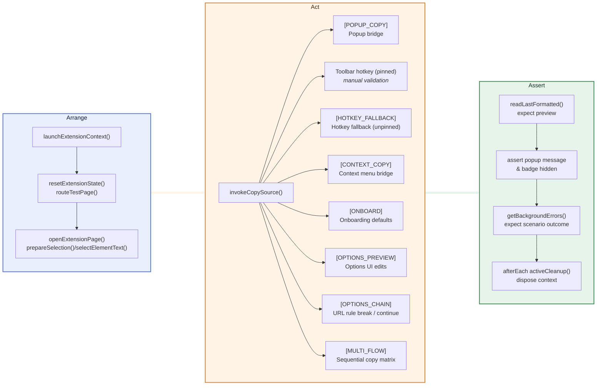

<!-- markdownlint-disable MD013 -->

# Automated Test Coverage

## Execution Commands

- `pnpm test:unit` — runs Vitest with coverage across `tests/unit/**`.
- `pnpm exec playwright test --project=chromium-extension` — runs the Playwright suite in headless Chromium with the packaged extension.
- `pnpm test:e2e` — convenience task that builds the extension and executes every Playwright project defined in `playwright.config.ts`.
- `pnpm run build:e2e` — rebuild the extension with E2E hooks enabled (automatically executed by `pnpm test:e2e`, but handy when debugging Playwright flows manually).

## Unit Suites (Vitest)

| Scenario                                                                                      | Location                                      |
| --------------------------------------------------------------------------------------------- | --------------------------------------------- |
| Background copy pipeline queueing, popup retry handshake                                      | `tests/unit/background.copy-pipeline.test.ts` |
| Background error logging, badge updates, protected-page filtering                             | `tests/unit/background.errors.test.ts`        |
| E2E bridge message handlers (trigger-command, context copy, error log helpers, storage reset) | `tests/unit/background.e2e.test.ts`           |
| Popup copy-flow messaging and clipboard fallbacks                                             | `tests/unit/popup.copy-flow.test.ts`          |
| Popup DOM bootstrap (required elements)                                                       | `tests/unit/popup.dom.test.ts`                |
| Options controllers (drag/drop, rule persistence, DOM rendering)                              | `tests/unit/options.*.test.ts`                |
| Entry-point loaders for popup/options                                                         | `tests/unit/entries.*.test.ts`                |
| Markdown conversion helpers                                                                   | `tests/unit/converter.test.ts`                |

## End-to-End Flows (Playwright)

Instead of an isolated table, the following graph outlines the shared setup and branching user flows the Playwright specs exercise. Nodes with multiple outgoing edges represent points where different user actions reuse the same groundwork.

AAA = Arrange → Act → Assert — this is the structure the diagram follows.

- **Arrange (Preparation)**: the `beforeEach` hooks call helpers like `launchExtensionContext`, `resetExtensionState`, `routeTestPage`, and `selectElementText` to generate an authentic DOM selection before any trigger runs. This matches the Arrange step of Arrange–Act–Assert (AAA).
- **Act (Trigger)**: the graph highlights each user action after Arrange.
- `tests/e2e/multi-trigger-flows.spec.ts` keeps a single extension session alive and chains popup, hotkey fallback, context menu, and protected-page failures. After each trigger the spec polls the host clipboard (via `clipboardy`) before asserting the formatted Markdown, so a broken write leaves a failing assertion instead of a cached preview.
- **Tag legend**: every Playwright spec name starts with a `[TAG]` prefix (e.g. `[CONTEXT_COPY]`, `[HOTKEY_FALLBACK]`, `[POPUP_COPY]`, `[MULTI_FLOW]`). Run an individual flow with `pnpm exec playwright test --grep "[TAG]"`. Tags remain stable documentation shortcuts even though clipboard assertions now read the host clipboard directly.
  - *Pros*: documentation stays stable even if files move, and targeting a scenario only requires a grep string.
  - *Cons*: tags demand consistent naming; if a tag is renamed, every reference must be updated, and locating the underlying file may require a quick search.
  - `[POPUP_COPY]`, `[POPUP_DARK]`, and `[POPUP_LIGHT]` cover popup requests (`chrome.runtime.sendMessage` on load) and light/dark rendering. We still list the pinned hotkey path here, but automation cannot drive the popup (see limitations below).
  - `[FEEDBACK]` exercises the feedback CTA to ensure it opens the repository issue tracker.
  - `[OPTIONS_PREVIEW]` and `[OPTIONS_CHAIN]` edit title and URL rules, then confirm the popup preview mirrors the new formatting.
  - `[ONBOARD]` resets storage to defaults and confirms the popup produces the default template on the first copy.
  - `[HOTKEY_FALLBACK]` forces the action to appear unpinned so the background logs `HotkeyOpenPopup` and falls back to direct copy without opening the popup. The flow now asserts the OS clipboard to guarantee the fallback succeeds.
  - `[CONTEXT_COPY]` simulates the context-menu request by calling the background bridge. Clipboard assertions run against the host OS, making failures immediately visible.
- **Act limitations**: Chromium ignores both `chrome.action.openPopup()` (toolbar icon click) and the keyboard shortcut when the toolbar icon is pinned, so those flows require manual verification during release QA. The fallback path (icon unpinned) remains covered automatically.
- **Assert (Validation + cleanup)**: every automated flow asserts the formatted Markdown returned by `e2e:get-last-formatted`, checks that the popup message and preview are visible when expected, ensures the badge stays hidden (unless the scenario intentionally logs), and inspects the background error log. Clipboard verification now polls the real OS clipboard via `clipboardy`, so a failing write surfaces immediately (and the tests snapshot/restore the clipboard to avoid polluting the developer’s session).

### Coverage Map & Known Gaps

| Tag                 | Flow / Behaviour                      | Coverage status                            | Notes                                                          |
| ------------------- | ------------------------------------- | ------------------------------------------ | -------------------------------------------------------------- |
| `[POPUP_COPY]`      | Popup runtime message + preview       | ✅ `--grep "[POPUP_COPY]"`                 | Popup re-requests selection after Playwright edits, OS clipboard asserted                 |
| `[POPUP_DARK]`      | Popup markdown render (dark theme)    | ✅ `--grep "[POPUP_DARK]"`                | Verifies dark-mode styling stays stable                        |
| `[POPUP_LIGHT]`     | Popup markdown render (light theme)   | ✅ `--grep "[POPUP_LIGHT]"`               | Mirrors `[POPUP_DARK]` for light theme                         |
| `[FEEDBACK]`        | Popup feedback CTA                    | ✅ `--grep "[FEEDBACK]"`                  | Ensures the repo link opens in new tab                         |
| `[OPTIONS_PREVIEW]` | Options rule editing -> popup preview | ✅ `--grep "[OPTIONS_PREVIEW]"`           | Confirms DOM updates + badge hidden                            |
| `[OPTIONS_CHAIN]`   | URL rule break/continue semantics     | ✅ `--grep "[OPTIONS_CHAIN]"`             | Validates rule sequencing outputs                              |
| `[ONBOARD]`         | Onboarding first copy                 | ✅ `--grep "[ONBOARD]"`                   | Resets storage, checks default template                        |
| `[CONTEXT_COPY]`    | Context menu copy                     | ✅ `--grep "[CONTEXT_COPY]"`               | Exercises tab-side clipboard write and badge/error assertions                            |
| `[HOTKEY_FALLBACK]` | Hotkey fallback (toolbar unpinned)    | ✅ `--grep "[HOTKEY_FALLBACK]"`            | Verifies fallback telemetry and OS clipboard integration                                 |
| `[MULTI_FLOW]`      | Multi-trigger sequencing              | ✅ `--grep "[MULTI_FLOW]"`                 | Chains popup, hotkey, context menu, protected-page failure with OS clipboard asserts     |
| —                   | Hotkey with toolbar icon pinned       | 🔶 Manual release check                    | Chrome blocks scripted shortcut-triggered popup                |
| —                   | Toolbar icon click                    | 🔶 Manual release check                    | Same Chrome limitation on `chrome.action.openPopup()`          |
| —                   | Error log lifecycle                   | ⏳ Planned (Story 3.9 follow-up)           | Seed, render, dismiss badge via popup                          |

## Upcoming Coverage (Story 3.9)

- **Error log lifecycle** — seed errors through the bridge, confirm the badge and popup list reflect them, then clear the log and verify badge reset.

### Additional Scenarios to Cover

- Duplicate copy events (e.g., hotkey triggered twice without closing popup).
- Toolbar action click once Chrome exposes a safe automation API (currently manual).
- Protected page copy followed by manual fallback acknowledgement.
- Error badge state for popup-reported errors (e.g., background errors seeded before open).
- Toolbar hotkey (pinned) end-to-end confirmation — manual check until Chromium allows scripted `chrome.action.openPopup()`.
