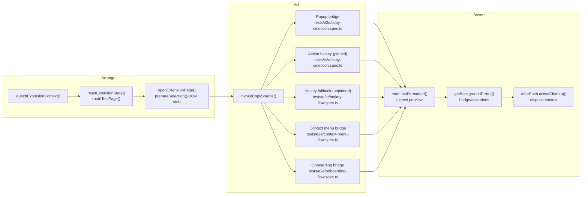

# Automated Test Coverage

## Execution Commands

- `pnpm test:unit` — runs Vitest with coverage across `tests/unit/**`.
- `pnpm exec playwright test --project=chromium-extension` — runs the Playwright suite in headless Chromium with the packaged extension.
- `pnpm test:e2e` — convenience task that builds the extension and executes every Playwright project defined in `playwright.config.ts`.

## Unit Suites (Vitest)

| Scenario                                                                                      | Location                                      |
| --------------------------------------------------------------------------------------------- | --------------------------------------------- |
| Background copy pipeline queueing, popup retry handshake                                      | `tests/unit/background.copy-pipeline.test.ts` |
| Background error logging, badge updates, protected-page filtering                             | `tests/unit/background.errors.test.ts`        |
| E2E bridge message handlers (trigger-command, context copy, error log helpers, storage reset) | `tests/unit/background.e2e.test.ts`           |
| Popup copy-flow messaging and clipboard fallbacks                                             | `tests/unit/popup.copy-flow.test.ts`          |
| Popup DOM bootstrap (required elements)                                                       | `tests/unit/popup.dom.test.ts`                |
| Options controllers (drag/drop, rule persistence, DOM rendering)                              | `tests/unit/options.*.test.ts`                |
| Entry-point loaders for popup/options                                                         | `tests/unit/entries.*.test.ts`                |
| Markdown conversion helpers                                                                   | `tests/unit/converter.test.ts`                |

## End-to-End Flows (Playwright)

Instead of an isolated table, the following graph outlines the shared setup and branching user flows the Playwright specs exercise. Nodes with multiple outgoing edges represent points where different user actions reuse the same groundwork.

### Flow Highlights

*(AAA = Arrange → Act → Assert — this is the structure the diagram follows.)*

- **Arrange (Preparation)**: the `beforeEach` hooks call helpers like `launchExtensionContext`, `resetExtensionState`, `primeSelectionStub`, and `open content tab` to provide a real selection before any trigger runs. This matches the Arrange step of Arrange–Act–Assert (AAA).
- **Act (Trigger)**: the graph highlights each user action after Arrange.
  - `tests/e2e/copy-selection.spec.ts` covers popup requests (`chrome.runtime.sendMessage` on load) and the standard hotkey path (action pinned).
  - `tests/e2e/onboarding-flow.spec.ts` resets storage to defaults and confirms the popup produces the default template on the first copy.
  - `tests/e2e/hotkey-flow.spec.ts` forces the action to appear unpinned so the background logs `HotkeyOpenPopup` and falls back to direct copy without opening the popup. The test verifies both the copied preview and the recorded warning.
  - `tests/e2e/context-menu-flow.spec.ts` simulates the context-menu request by calling the background bridge, ensuring the preview is generated and no errors are logged.
- **Assert (Validation + cleanup)**: all flows assert the formatted markdown returned by `e2e:get-last-formatted` and check the relevant side effects (badge/errors where applicable). Clipboard success is accepted when the preview text matches—actual OS clipboard access remains outside automated scope.

## Upcoming Coverage (Story 3.9)

- **Error log lifecycle** — seed errors through the bridge, confirm the badge and popup list reflect them, then clear the log and verify badge reset.

### Additional Scenarios to Cover

- Duplicate copy events (e.g., hotkey triggered twice without closing popup).
- Toolbar action click once Chrome exposes a safe automation API (currently manual).
- Protected page copy followed by manual fallback acknowledgement.
