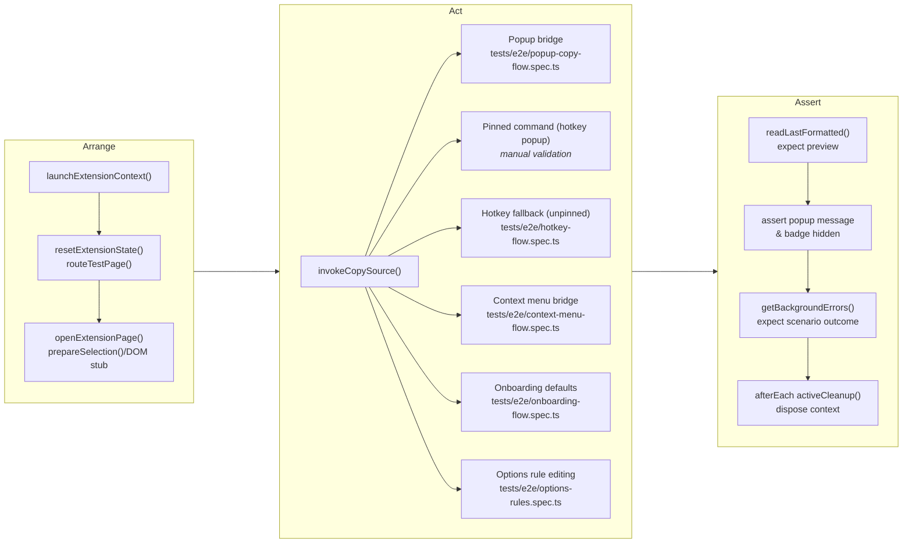

# Automated Test Coverage

## Execution Commands

- `pnpm test:unit` — runs Vitest with coverage across `tests/unit/**`.
- `pnpm exec playwright test --project=chromium-extension` — runs the Playwright suite in headless Chromium with the packaged extension.
- `pnpm test:e2e` — convenience task that builds the extension and executes every Playwright project defined in `playwright.config.ts`.

## Unit Suites (Vitest)

| Scenario                                                                                      | Location                                      |
| --------------------------------------------------------------------------------------------- | --------------------------------------------- |
| Background copy pipeline queueing, popup retry handshake                                      | `tests/unit/background.copy-pipeline.test.ts` |
| Background error logging, badge updates, protected-page filtering                             | `tests/unit/background.errors.test.ts`        |
| E2E bridge message handlers (trigger-command, context copy, error log helpers, storage reset) | `tests/unit/background.e2e.test.ts`           |
| Popup copy-flow messaging and clipboard fallbacks                                             | `tests/unit/popup.copy-flow.test.ts`          |
| Popup DOM bootstrap (required elements)                                                       | `tests/unit/popup.dom.test.ts`                |
| Options controllers (drag/drop, rule persistence, DOM rendering)                              | `tests/unit/options.*.test.ts`                |
| Entry-point loaders for popup/options                                                         | `tests/unit/entries.*.test.ts`                |
| Markdown conversion helpers                                                                   | `tests/unit/converter.test.ts`                |

## End-to-End Flows (Playwright)

Instead of an isolated table, the following graph outlines the shared setup and branching user flows the Playwright specs exercise. Nodes with multiple outgoing edges represent points where different user actions reuse the same groundwork.

AAA = Arrange → Act → Assert — this is the structure the diagram follows.

- **Arrange (Preparation)**: the `beforeEach` hooks call helpers like `launchExtensionContext`, `resetExtensionState`, `primeSelectionStub`, and `open content tab` to provide a real selection before any trigger runs. This matches the Arrange step of Arrange–Act–Assert (AAA).
- **Act (Trigger)**: the graph highlights each user action after Arrange.
  - `tests/e2e/popup-copy-flow.spec.ts` covers popup requests (`chrome.runtime.sendMessage` on load) and light/dark rendering. We still list the pinned hotkey path here, but automation cannot drive the popup (see limitations below).
  - `tests/e2e/popup-feedback.spec.ts` exercises the feedback CTA to ensure it opens the repository issue tracker.
  - `tests/e2e/options-rules.spec.ts` edits title and URL rules, then confirms the popup preview mirrors the new formatting.
  - `tests/e2e/onboarding-flow.spec.ts` resets storage to defaults and confirms the popup produces the default template on the first copy.
  - `tests/e2e/hotkey-flow.spec.ts` forces the action to appear unpinned so the background logs `HotkeyOpenPopup` and falls back to direct copy without opening the popup. The test verifies both the copied preview and the recorded warning.
  - `tests/e2e/context-menu-flow.spec.ts` simulates the context-menu request by calling the background bridge, ensuring the preview is generated and no errors are logged.
- **Act limitations**: Chromium ignores both `chrome.action.openPopup()` (toolbar icon click) and the keyboard shortcut that opens the popup when the action is pinned, so those flows require manual verification during release QA. The fallback path (unpinned toolbar) remains covered automatically.
- **Assert (Validation + cleanup)**: every automated flow asserts the formatted markdown returned by `e2e:get-last-formatted`, checks that the popup message and preview are visible when expected, ensures the error badge stays hidden (unless the scenario intentionally logs), and inspects the background error log. Clipboard success is inferred from the preview text—actual OS clipboard access remains outside automated scope.

### Coverage Map & Known Gaps

| Flow / Behaviour                      | Coverage status                         | Notes |
| ------------------------------------- | --------------------------------------- | ----- |
| Popup runtime message + preview       | ✅ `tests/e2e/popup-copy-flow.spec.ts`   | Covers runtime message + theme variants |
| Popup feedback CTA                    | ✅ `tests/e2e/popup-feedback.spec.ts`    | Ensures the repo link opens in new tab |
| Options rule editing -> popup preview | ✅ `tests/e2e/options-rules.spec.ts`     | Confirms DOM updates + badge hidden |
| Onboarding first copy                 | ✅ `tests/e2e/onboarding-flow.spec.ts`   | Resets storage, checks default template |
| Context menu copy                     | ✅ `tests/e2e/context-menu-flow.spec.ts` | Preview generated, no errors logged |
| Hotkey fallback (toolbar unpinned)    | ✅ `tests/e2e/hotkey-flow.spec.ts`       | Logs warning, still returns preview |
| Pinned shortcut opens popup           | 🔶 Manual release check                  | Chrome blocks scripted shortcut-triggered popup |
| Toolbar icon click                    | 🔶 Manual release check                  | Same Chrome limitation on `chrome.action.openPopup()` |
| Multiple-trigger resilience           | 🔁 Not automated                         | Add scenario for rapid repeated triggers |
| Error log lifecycle                   | ⏳ Planned (Story 3.9 follow-up)         | Seed, render, dismiss badge via popup |

## Upcoming Coverage (Story 3.9)

- **Error log lifecycle** — seed errors through the bridge, confirm the badge and popup list reflect them, then clear the log and verify badge reset.

### Additional Scenarios to Cover

- Duplicate copy events (e.g., hotkey triggered twice without closing popup).
- Toolbar action click once Chrome exposes a safe automation API (currently manual).
- Protected page copy followed by manual fallback acknowledgement.
- Error badge state for popup-reported errors (e.g., background errors seeded before open).
- Toolbar hotkey (pinned) end-to-end confirmation — manual check until Chromium allows scripted `chrome.action.openPopup()`.
